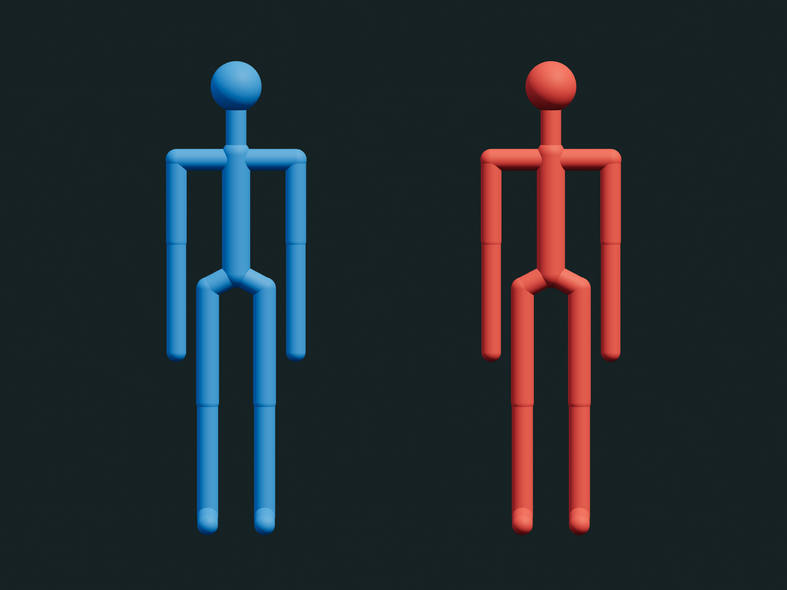

# Shared stick figure

One original model used by both Hide and Seek and Learn to Dive: straight
cylinders with round endpoints and one small sphere head. The two instanced meshes
draw eighteen segments and twenty joint markers. There is no sculpted mesh, GLB,
face, clothing, skinning, pose generator or animation clip. Only the role color
changes between uses; dimensions and model code are shared. `NEUTRAL_POSE` and
`MODEL` provide the one canonical set of landmarks and limb lengths. Hide and
Seek scales this 1.743 m figure uniformly to 0.70 m; Dive uses the actual physical
landmarks in meters. Neither application defines a second character mesh.

Used by [Hide and Seek](https://github.com/Zachshotamartin/HideAndSeek) and
[Learn to Dive](https://github.com/Zachshotamartin/LearnToDive).

Run `npm ci` and `npm test` with Node 22 or newer. Tests check matching geometry
across roles, rigid pose transforms, and the actual elbow and knee endpoints.

`createStickFigure({color})` returns `root`, `ready`, `apply(pose)`,
`getRenderedJoints()`, `diagnostics()` and `dispose()`. `apply` takes named 3D joint
landmarks in the root's local coordinates. The caller owns motion and physical
scale. Dive supplies MuJoCo joint positions; Hide and Seek supplies gait and grip
IK based on actual agent movement and contacts. The visual figure is not collision
geometry or an independent controller.

MIT © Zachary Martin, 2026. Three.js is a peer dependency. This small package is
the sole model source for both applications.
